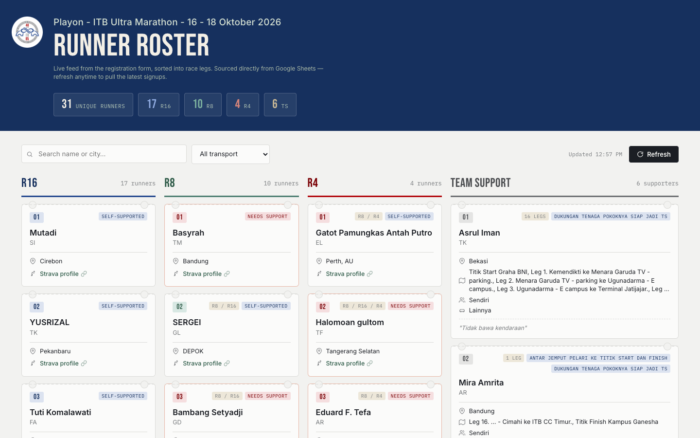
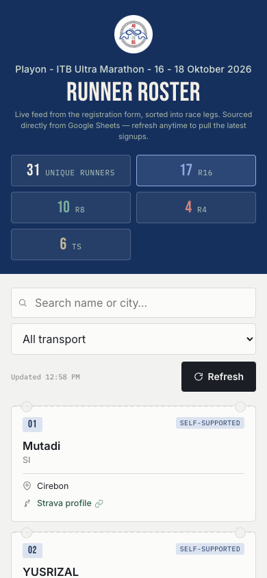

# Playon ITB 85 — Runner Roster Dashboard

Live dashboard for **Playon ITB 85** at the **ITB Ultra Marathon 2026** (16–18 Oktober 2026). The page pulls runner and team-support signups from Google Sheets and displays them in four columns: **R16**, **R8**, **R4**, and **Team Support (TS)**.

## Live site

**[primayuda.github.io/playon85](https://primayuda.github.io/playon85/)**

Hosted on GitHub Pages from the `main` branch.

### Desktop

Four runner/support columns at wide viewports (2×2 grid on medium screens).

### Mobile

On a phone, stats appear in a grid and one leg is shown at a time — tap **R16**, **R8**, **R4**, or **TS** to switch.

## Features

- **Live roster** — Fetches the latest runner signups from a Google Sheet (view-only)
- **Race legs** — Runners grouped into **R16**, **R8**, and **R4** columns
- **Multi-leg runners** — If someone registers for more than one leg, they appear in one column only: **R4** first, then **R8**, then **R16** (all legs still shown on the card badge)
- **Team Support** — Separate column for TS volunteers (legs, support type, vehicle, notes)
- **Header stats** — Unique runner count plus R16, R8, R4, and TS totals
- **Search & filter** — Search runners and supporters by name or city; filter runners by transport (self-supported / needs support)
- **Auto-refresh** — Updates every 5 minutes, or click **Refresh** anytime
- **Runner cards** — Bib number, name, major, city, Strava link (green when valid), transport badges, and notes
- **TS cards** — Supporter name, major, city, support legs, badges, vehicle, and who they support with

## Data sources

Two Google Sheets registration forms feed the dashboard. Both must be shared as **“Anyone with the link can view”**:

| Sheet | Used for |
|-------|----------|
| Runner roster | R16, R8, and R4 runner cards |
| Team Support | TS supporter cards |

Phone numbers from either form are not shown on the dashboard.

## Repository

[github.com/primayuda/playon85](https://github.com/primayuda/playon85)
