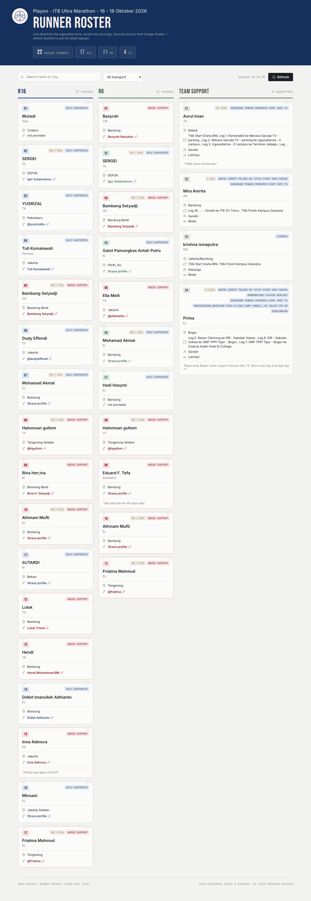

# Playon ITB 85 — Runner Roster Dashboard

Live runner roster dashboard for **Playon ITB 85** at the **ITB Ultra Marathon 2026** (16–18 Oktober 2026). The page pulls registration data from Google Sheets and displays runners grouped by race leg.

## Features

- **Live roster** — Fetches the latest signups from a Google Sheet (view-only)
- **Race legs** — Runners sorted into **R16**, **R8**, and **R4** columns
- **Search & filter** — Find runners by name or city; filter by transport (self-supported / needs support)
- **Auto-refresh** — Updates every 5 minutes, or click **Refresh** anytime
- **Runner cards** — Name, major, city, Strava link, transport badges, and notes

## Live site

**[primayuda.github.io/playon-dashboard-2026](https://primayuda.github.io/playon-dashboard-2026/)**

Hosted on GitHub Pages from the `main` branch.

## Data source

Runner data comes from a Google Sheets registration form. The sheet must be shared as **“Anyone with the link can view”** for the dashboard to load.

## Repository

[github.com/primayuda/playon-dashboard-2026](https://github.com/primayuda/playon-dashboard-2026)
